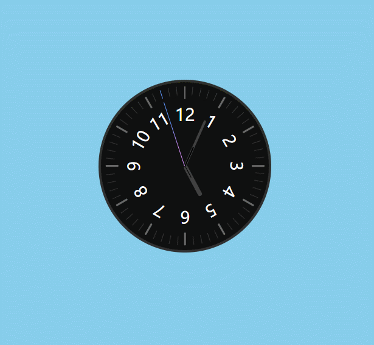

## 欢迎来到CLOCK
clock是[HCJDemo](https://github.com/zuogl/HCJDemo.git)的第二个demo
> HCJDemo是一个旨在利用纯粹的html、CSS、JS这三个前端基础工具，通过写一些比较有意思的东西以锻炼逻辑思维并提升对前端基础工具的理解运用的项目。HCJDemo项目地址:
[github](https://github.com/zuogl/HCJDemo.git)
[Gitee](https://gitee.com/xiao-zuo/hcjdemo.git)

### 一、demo效果
clock的最终效果是模拟一个带指针的时钟，并且被秒针指着的刻度会变色。


### 二、解决思路
要想实现以上功能，需要做到以下几点：
- 刻度和数字的旋转排列`transform-origin: 1px 95px;`
- 通过`Date`对象，实时获取系统时间
- 利用循环定时器`setInterval（）`每秒改变一次秒针的旋转角度。
- 获取每个刻度线的`transform`对应的角度值，和指针的角度值进行比对，一致就通过`.classList.add`添加类改变颜色。

### 三、知识点梳理
#### 1. HTML
无
#### 2. CSS
1. `transform-origin`:元素的旋转中心是可以通过给定数字定义到屏幕的任意位置的（数字的起始点在元素的左上角）在本Demo中，所有的刻度线的旋转中心都是在圆盘中心的。
2. **线性渐变**:线性渐变的本质是在画图，所以运用的属性是`background-image`。下边代码表示，从底部到头部进行线性渐变，从0-30%，为#d48cf6,从30%-70%为这两种颜色的渐变，从70%-100%为#5d96ff。
    ```js
    background-image: linear-gradient(to top, #d48cf6 30%, #5d96ff 70%);
    ```


#### 3. JS
1. `.classList.add()`添加类，.classList.remove()`删除类。
2. `new Date().getHours()`:获取小时（1-12）；
3. `new Date().getMinutes()`:获取小时（1-60）；
4. `new Date().getSeconds()`:获取小时（1-60）；
### 四、代码片段
#### html
```html
    <!-- 表盘 -->
    <div class="clockbody">
        <!-- 刻度盘 -->
        <ul class="num">
            <!-- 动态创建刻度 -->
        </ul>
        <!--数字盘 -->
        <ul class="face">
            <!-- 动态创建数字 -->
        </ul>
        <div class="houer">
            <div></div>
        </div>
        <div class="min">
            <div></div>
        </div>
        <div class="sec"></div>
    </div>
```
#### CSS
```css
body .clockbody .face {
  width: 75%;
  height: 75%;
  padding: 0;
  margin: 0;
  border-radius: 50%;
  position: absolute;
  left: 50%;
  top: 50%;
  transform: translate(-50%, -50%);
}
body .clockbody .num > li {
  list-style: none;
  width: 1px;
  height: 10px;
  float: left;
  position: absolute;
  left: 0;
  right: 0;
  margin: 5px auto;
  transform-origin: 1px 95px;
  border-radius: 1px;
}
```


#### js
```js
    setInterval(function () {
        var d = new Date();
        secnode = document.querySelector('.sec')
        var s = d.getSeconds() * 6;
        if (s == 0) {
            houernode = document.querySelector('.houer');
            minnode = document.querySelector('.min');
            var m = d.getMinutes() * 6;
            var h = d.getHours() * 30 + d.getMinutes() * 0.5;
            minnode.style.transform = `rotate(${m}deg)`;
            houernode.style.transform = `rotate(${h}deg)`;
        }
        secnode.style.transform = `rotate(${s}deg)`;

        // 让刻度盘的指针随着秒针变化
        for (var i = 0; i < lilist.length; i++) {
            if (Number(lilist[i].style.transform.slice(7, -4)) === s) {
                lilist[i].classList.add('right')
            } else {
                lilist[i].classList.remove('right')
            }
        }

    }, 1000)
```


