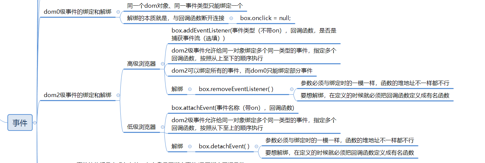

## 欢迎来到Flex Panel Gallery
Flex Panel Gallery是[HCJDemo](https://github.com/zuogl/HCJDemo.git)的第四个demo
> HCJDemo是一个旨在利用纯粹的html、CSS、JS这三个前端基础工具，通过写一些比较有意思的东西以锻炼逻辑思维并提升对前端基础工具的理解运用的项目。HCJDemo项目地址:
[github](https://github.com/zuogl/HCJDemo.git)
[Gitee](https://gitee.com/xiao-zuo/hcjdemo.git)

### 一、demo效果
Flex Panel Gallery的最终交互效果：
- 点击任意一张图片，图片展开，同时从图片上下两方分别移入文字。
- 点击已经展开的图片后，图片被压缩，同时该图片上下两端的文字飞走。


### 二、解决思路
图片的展开和压缩可以利用弹性布局中的`flex`来实现，文字的飞入和飞出可以用`transition`和`transform`来解决。

### 三、知识点梳理及代码展示
#### 1. HTML
无
```html
<div class="panels">
    <div class="panel panel1">
        <p class="notCenter" >You could write</p>
        <p>我</p>
        <p class="notCenter" >something here ! </p>
    </div>
    <div class="panel panel2">
        <p class="notCenter">You could write</p>
        <p>爱</p>
        <p class="notCenter">something here ! </p>
    </div>
    <div class="panel panel3">
        <p class="notCenter">You could write</p>
        <p>打</p>
        <p class="notCenter">something here ! </p>
    </div>
    <div class="panel panel4">
        <p class="notCenter">You could write</p>
        <p>游</p>
        <p class="notCenter">something here ! </p>
    </div>
    <div class="panel panel5">
        <p class="notCenter">You could write</p>
        <p>戏</p>
        <p class="notCenter">something here ! </p>
    </div>
</div>
```

#### 2. CSS
1. 弹性布局推荐阮一峰大佬的文章：[弹性布局实列](https://www.ruanyifeng.com/blog/2015/07/flex-examples.html)
2. 复合属性`background`
- `background`是由`background-color`、`background-image`、`background-repate`、`background-position`组合而成的一个复合属性，在书写时需要按照背景色、背景图、平铺方式、水平位置、垂直位置的顺序书写，中间用空格隔开，默认值可以不写。
    - `background-repate`有如下可选值：
        - repate:水平垂直平铺
        - repate-x：水平平铺
        - repate-y：垂直平铺
        - no-repate:不平铺
    - `background-position`有如下可选值：
        - 水平位置(可以用数值表示，正值向右，负值向左)：
            - left:靠左
            - center:居中
            - right:靠右
        - 垂直位置(可以用数值表示，正值向下，负值向上)：
            - top:考上
            - center:居中
            - bottom:靠下
3. 2D转换`transform`
`transform`可以让元素基于自身做一些移动(translate)、旋转(rotate)和缩放(scale)。

4. 过渡`transition`

```js
html body {
	padding: 0;
	margin: 0;
}
.panel1 {
	background: url(img/002.jpg) 601px 0;
}
.panel2 {
	background: url(img/005.jpg) center 0;
}
.panel3 {
	background: url(img/003.jpg) center -126px;
}
.panel4 {
	background: url(img/004.jpg) center -200px;
}
.panel5 {
	background: url(img/001.jpg) -258px -100px;
}
.panels {
	display: flex;
	height: 100vh;
	.panel {
		flex: 1;
		display: flex;
		flex-direction: column;
		justify-content: space-around;
		transition: font-size 0.7s cubic-bezier(0.61, -0.19, 0.7, -0.11),
			flex 0.7s cubic-bezier(0.61, -0.19, 0.7, -0.11), background 0.2s;
		font-size: 60px;
		p {
			color: white;
			text-align: center;
		}
		&　> p:first-child {
            transition: all 0.7s 0.7s;
			transform: translateY(-500%);
			font-size: 20px;
		}
        &.open >:first-child{
            transform: translateY(0);
        }
		&　> p:last-child {
            transition: all 0.7s 0.7s;
			transform: translateY(500%);
			font-size: 20px;
		}
        &.open >:last-child{
            transform: translateY(0);
        }
	}
	.open {
		flex: 3;
		font-size: 100px;
	}
}

```
#### 3. JS
1. classList
classList 属性可以返回元素的类名，通常用于在元素中添加，移除及切换 CSS 类，有四个常用的方法：
    - add(class1,class2...)
        add用于给指定的元素添加一个或多个类，如果指定的类名已经存在，则不会添加，不会报错
    - remove(class1,class2...)
        remove用于移除指定元素的一个或多个类，移除不存在的类，也不会报错
    - contains(class)
        contains用于判断指定的元素是否存在某一个类，返回值为布尔值
    - toggle(class,true | false)
        toggle用于切换类名，第一个参数是要切换的类名，如果在元素中包含该类名，则移除，如果不存在，则添加；第二个是可选参数，用于表示是否强制切换。
2. dom0级事件和dom2级事件

```js
window.onload = () => {
    // 通过querySelectorAll拿到所有的panel元素
    let panels = document.querySelectorAll(".panel")
    function open() {
        this.classList.toggle('open');
    }
// 循环遍历所有的pannel元素，给每个元素绑定click事件
    panels.forEach((panel) => {
        panel.addEventListener('click', open)
    })
}
```


