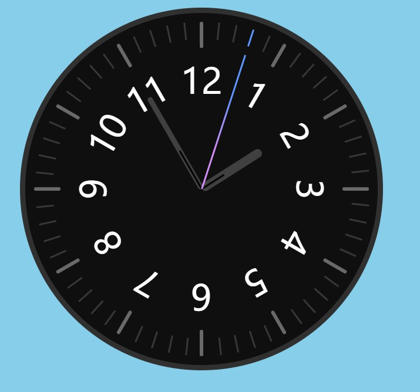

## HCJDemo介绍
---

欢迎来到HCJDemo

> HCJDemo是一个旨在利用纯粹的html、CSS、JS这三个前端基础工具，通过写一些比较有意思的东西以锻炼逻辑思维并提升对前端基础工具的理解运用的项目。 

当然，笔者认为类似less这样的css预处理语言，在不使用其变量、Mixin、函数等特性的时候，是和css没有什么太大的区别的。为了避免出现css结构路径查找问题，笔者的所有css样式都是用less编译的。 
HCJDemo项目地址: 
[github](https://github.com/zuogl/HCJDemo.git) 
[Gitee](https://gitee.com/xiao-zuo/hcjdemo.git) 

### 灵感来源与JavaScript30
该项目的灵感来源于`wesbos`发起的JavaScript30项目，这是一个旨在使用纯Js来进行练习，不允许使用任何其他的库和框架的项目，该项目共有30个小的挑战。 
[JavaScript30的github源地址](https://github.com/wesbos/JavaScript30.git)。 
[JavaScript30官网](https://javascript30.com/) 

### 导航及效果展示
1. [clock](https://github.com/zuogl/HCJDemo/tree/master/Clock)
     
    clock的最终效果是模拟一个带指针的时钟，并且被秒针指着的刻度会变色。
    
    
2. [css变量](https://github.com/zuogl/HCJDemo/tree/master/CSS_Variables)
     
    CSS_Variables的最终效果是通过滑动滑动条来改变图片及展示区域对应的属性。
    

3. [Flex Panel Gallery](https://github.com/zuogl/HCJDemo/tree/master/Flex%20Panel%20Gallery)
     
    Flex Panel Gallery的最终交互效果：
    - 点击任意一张图片，图片展开，同时从图片上下两方分别移入文字。
    - 点击已经展开的图片后，图片被压缩，同时该图片上下两端的文字飞走。
    

4. [tabBar](https://github.com/zuogl/HCJDemo/tree/master/TabBar)
     
    tabBar是一个可以用于移动端的具有特效的底边栏.
    

5. test