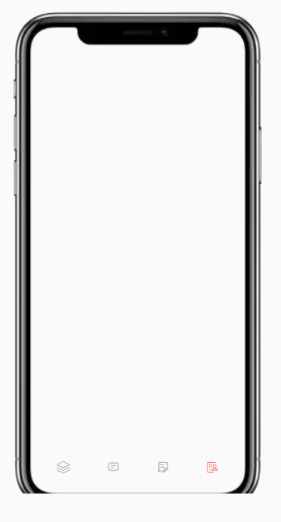

## 欢迎来到BATBAR
tabBar是[HCJDemo](https://github.com/zuogl/HCJDemo.git)的第四个demo
> HCJDemo是一个旨在利用纯粹的html、CSS、JS这三个前端基础工具，通过写一些比较有意思的东西以锻炼逻辑思维并提升对前端基础工具的理解运用的项目。HCJDemo项目地址:
[github](https://github.com/zuogl/HCJDemo.git)
[Gitee](https://gitee.com/xiao-zuo/hcjdemo.git)

### 一、demo效果
tabBar是一个可以用于移动端的具有特效的底边栏

### 二、解决思路
无

### 三、知识点梳理
无
### 四、原文出处
该效果的原创地址为 [dev.to/ romaopedro199](https://dev.to/romaopedro199/tap-bar-with-liquid-animation-using-css-and-javascript-2l99)

